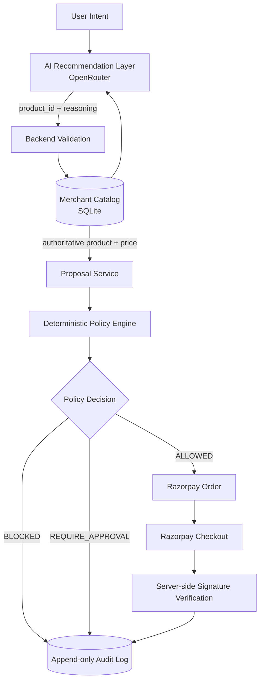

# SentinelCart Architecture

## 1. System Overview

SentinelCart is a policy gateway for agentic commerce.

Its core principle is:

> **The agent proposes. The policy engine decides. Razorpay executes.**

The system deliberately separates probabilistic recommendation from deterministic financial authorization.



---

# 2. Trust Boundary

The most important architectural decision is that the AI is **not** the financial authority.

### AI is responsible for

* understanding natural-language intent
* selecting a product from backend-provided candidates
* generating recommendation reasoning

### AI is NOT responsible for

* authoritative pricing
* transaction authorization
* policy decisions
* Razorpay order creation
* payment amounts
* payment verification
* audit mutation

The backend independently re-fetches the selected product from the merchant database before creating the proposal.

```text
                 PROBABILISTIC
                     AI
                      │
                      │ product_id + reasoning
                      ▼
             ┌──────────────────┐
             │ Backend validates│
             └────────┬─────────┘
                      │
                      ▼
             ┌──────────────────┐
             │ SQLite catalog   │
             │ authoritative    │
             │ price            │
             └────────┬─────────┘
                      │
                      ▼
             ┌──────────────────┐
             │ Policy Engine    │
             │ deterministic     │
             └────────┬─────────┘
                      │
                  ALLOWED only
                      │
                      ▼
                  Razorpay
```

This means changing the underlying AI provider does not change the authorization model.

---

# 3. Request Lifecycle

## Step 1 — User intent

The user describes a desired purchase in natural language.

Example:

```text
"I need something to keep my laptop cool during long coding sessions."
```

The frontend sends:

```http
POST /api/v1/intent
```

---

## Step 2 — AI recommendation

`AIProductRecommender` sends the intent and merchant-provided catalog candidates to OpenRouter.

The model is asked to return:

```json
{
  "product_id": 11,
  "reasoning": "The cooling pad directly addresses sustained laptop heat during long coding sessions."
}
```

The model's response is parsed and validated by the backend.

The backend accepts only a product ID belonging to the supplied catalog candidates.

---

# 4. Authoritative Pricing

The model does not determine the transaction amount.

After receiving the selected product ID, SentinelCart re-fetches the product directly from SQLite.

The proposal service obtains:

```python
authoritative_price = product.current_price
```

and stores that value as:

```text
quoted_price_snapshot
```

The price therefore follows:

```text
Merchant database
        ↓
Proposal snapshot
        ↓
Policy evaluation
        ↓
Razorpay order amount
```

not:

```text
LLM
 ↓
price
 ↓
payment
```

This prevents model output from changing the amount charged.

---

# 5. Policy Engine

The policy engine is deterministic and independent of the payment provider.

Current policy decisions:

```text
ALLOWED
BLOCKED
REQUIRE_APPROVAL
```

The engine evaluates conditions including:

* per-transaction limit
* session spending limit
* price drift
* duplicate-order protection

The policy engine is the authorization boundary.

An AI recommendation can influence **which product is proposed**, but it cannot directly influence whether the transaction is authorized.

---

# 6. Price Drift Protection

SentinelCart stores the price observed when the proposal was created.

Before creating a Razorpay order, the backend compares:

```text
Quoted price
Current merchant price
Allowed drift
Actual drift
```

Conceptually:

```text
T0
Proposal created
₹2,999
    │
    │ merchant price changes
    ▼
T1
Current price
₹3,162
    │
    ▼
Policy re-evaluation
    │
    ├── within tolerance → continue
    │
    └── outside tolerance → BLOCK
```

When the configured tolerance is exceeded:

```text
PRICE_DRIFT
→ BLOCKED
→ no Razorpay order created
```

This is treated as a stale-authorization problem, not automatically as merchant fraud.

The key design principle is:

> **The economic conditions used to form the recommendation must still be valid when the system is about to authorize payment.**

---

# 7. Razorpay Integration

Razorpay is used as the payment execution layer.

The sequence is:

```text
Policy ALLOWED
      ↓
Server creates Razorpay Order
      ↓
Frontend receives public Key ID + Order ID
      ↓
Razorpay Standard Checkout
      ↓
Payment response
      ↓
Backend verifies signature
      ↓
Transaction completed
```

The Razorpay Key Secret remains server-side.

The frontend does not receive the secret.

SentinelCart currently uses Razorpay Test Mode for the prototype.

---

# 8. Payment Verification

A successful browser callback is not treated as sufficient evidence of settlement.

The frontend submits:

```text
razorpay_payment_id
razorpay_order_id
razorpay_signature
```

to:

```http
POST /api/v1/payment/verify
```

The backend uses the server-side Razorpay secret to independently verify the HMAC-SHA256 signature.

Only after successful verification is the proposal/order marked completed.

The signature comparison uses a constant-time comparison.

---

# 9. Audit Trail

The audit log records the transaction journey.

Typical successful flow:

```text
Intent received
      ↓
Proposal created
      ↓
Policy evaluated
      ↓
Order created
      ↓
Payment verified
```

Blocked flow:

```text
Intent received
      ↓
Proposal created
      ↓
Policy evaluated
      ↓
PRICE_DRIFT / BLOCKED
      ↓
No Razorpay order created
```

The audit table is append-only and SQLite triggers prevent updates and deletes.

The purpose is not simply debugging.

It provides an explanation of:

* what the system saw
* what it proposed
* what policy decided
* whether payment execution occurred
* why execution stopped when it did

---

# 10. Failure Safety

The AI layer is intentionally non-authoritative.

If OpenRouter:

* is unavailable
* times out
* returns an HTTP error
* rate-limits
* returns malformed JSON
* returns an invalid product ID
* is not configured

SentinelCart falls back to the deterministic product matcher.

```text
                 OpenRouter
                     │
               ┌─────┴─────┐
               │           │
            success       failure
               │           │
               ▼           ▼
          AI result    deterministic
               │          fallback
               └─────┬─────┘
                     ▼
              normal proposal
                     ▼
               policy engine
```

Importantly, AI failure does not bypass policy.

The payment-control layer remains unchanged.

---

# 11. Idempotency and Duplicate Protection

SentinelCart uses an idempotency key for proposal creation.

Application/database constraints also protect against duplicate proposal-to-order relationships.

The intended property is:

```text
One proposal
     ↓
At most one application-level order
```

A retry should not silently create multiple application-level orders for the same proposal.

---

# 12. Data Model

SentinelCart currently uses four primary tables:

```text
products
    │
    │ selected by recommendation
    ▼
proposals
    │
    │ authorized proposal
    ▼
orders
    │
    │ payment lifecycle
    ▼
audit_log
```

### Products

Merchant-authoritative catalog and prices.

### Proposals

Stores the recommendation result and the price snapshot observed at proposal creation.

### Orders

Stores the payment order associated with an approved proposal.

### Audit Log

Stores the append-only event history.

---

# 13. Frontend Architecture

The React frontend presents one continuous commerce journey:

```text
Intent
   ↓
AI Proposal
   ↓
Policy Decision
   ↓
Razorpay Checkout
   ↓
Payment Verification
   ↓
Audit Trail
```

The frontend does not make authorization decisions.

It consumes backend decisions and displays them to the user.

Important UI distinction:

```text
Agent Reasoning
        ≠
Authoritative Price
```

The recommendation explanation is treated as contextual reasoning.

The merchant price is presented separately as authoritative application data.

---

# 14. API Boundary

Main API endpoints:

```http
POST /api/v1/intent
GET  /api/v1/proposal/{id}

POST /api/v1/proposal/{id}/checkout
POST /api/v1/proposal/{id}/approve

POST /api/v1/payment/verify

GET  /api/v1/audit/{proposal_id}
```

The important boundary is:

```text
POST /intent
    ↓
recommendation + proposal

POST /proposal/{id}/checkout
    ↓
policy authorization

POST /payment/verify
    ↓
cryptographic settlement verification
```

These responsibilities remain separated.

---

# 15. Why This Architecture

A generic AI commerce system can look like:

```text
User
 ↓
AI
 ↓
Buy
```

SentinelCart instead separates the probabilistic and financial responsibilities:

```text
User
 ↓
AI recommendation
 ↓
Independent validation
 ↓
Authoritative merchant state
 ↓
Deterministic authorization
 ↓
Razorpay
 ↓
Cryptographic verification
 ↓
Audit
```

The architecture is intentionally model-agnostic.

The recommendation model can change without changing the policy boundary.

This makes the policy layer reusable around different AI agents or recommendation systems.

---

# 16. Razorpay Ecosystem Fit

Razorpay is actively expanding toward AI-native commerce and exposing payment capabilities to developer and AI workflows. SentinelCart explores a complementary question:

> **Before an AI agent invokes a payment capability, should this particular action still be authorized?**

SentinelCart does not replace Razorpay's payment infrastructure.

It demonstrates a merchant/developer-side pattern for independently evaluating the action before payment execution.

The relationship is therefore:

```text
AI Agent
    ↓
SentinelCart Policy Gateway
    ↓
Razorpay Payment Infrastructure
```

rather than:

```text
AI Agent
    ↓
direct unrestricted payment authority
```

---

# 17. Technology Stack

### Frontend

* React
* TypeScript
* Vite
* CSS
* Razorpay Standard Checkout

### Backend

* Python
* FastAPI
* SQLAlchemy

### Data

* SQLite

### AI

* OpenRouter
* Hosted LLM

### Payments

* Razorpay Test Mode

### Testing

* pytest
* TypeScript/Vite production build
* Oxlint

---

# 18. Current Validation

Latest verified local state:

```text
Backend tests:        38 passed
Frontend build:       passed
Frontend lint:        passed

OpenRouter:
real manual requests tested

Razorpay:
Test Mode order creation verified
Test payment captured
Server-side signature verification verified

Price drift:
blocked-before-order scenario verified
```

---

# 19. Current Limitations

This prototype does not attempt to solve every agentic-commerce problem.

Out of scope:

* production authentication
* multi-user authorization
* multi-merchant support
* inventory race conditions
* tax/shipping-price changes
* coupon expiration
* refunds and chargebacks
* subscriptions
* distributed infrastructure
* production fraud detection
* real production payment processing

These are deliberate scope boundaries for the prototype.

---

# 20. Core Takeaway

SentinelCart is not primarily a product-search application.

Its core contribution is the separation:

```text
             AI
       recommendation
             │
             ▼
      POLICY GATEWAY
             │
      authorization
             │
             ▼
          RAZORPAY
          execution
```

The central principle is:

> **An AI system may recommend an economic action without automatically earning the authority to execute it.**

That is the boundary SentinelCart demonstrates.
